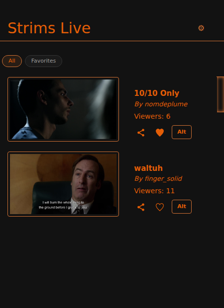
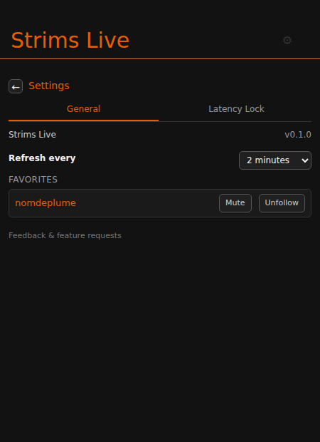
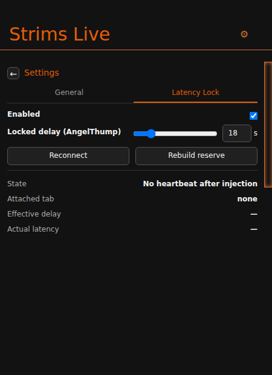

# strims-live-extension

Browser extension (Chrome & Firefox, Manifest V3) that shows which [strims.gg](https://strims.gg) channels are currently live, lets you favorite and get notified about channels, and includes a playback latency lock for AngelThump streams.

It doesn't stream or host any video itself — it's a lightweight listing/navigation layer on top of the strims.gg API, plus a client-side playback controller for AngelThump.

## Screenshots

| Live channel list | Settings — General | Settings — Latency Lock |
| --- | --- | --- |
|  |  |  |

## Release 0.1.0

This release merges what used to be two separate extensions — the original Strims Live popup and the standalone *AngelThump Latency Lock* — into one, and adds a round of features on top:

- **Latency Lock** folded in as a tab in the popup's settings (gear icon), instead of its own separate extension/popup
- **Favorites** now sync across your signed-in browser instances (`storage.sync`, migrated automatically from the old local-only storage), sort to the top of the list, can be filtered to an Favorites-only view, and can be individually muted from go-live notifications
- **Go-live notifications** — a real desktop notification when a favorited channel goes live, not just a badge-count change
- **Loading/error states** in the popup, with a Retry button, instead of a silently blank list on failure
- **Configurable refresh interval** (1–15 minutes) instead of a hardcoded 2 minutes
- **Alt egress button** — jump straight to strims.gg's server picker (`strims.gg/advanced/...`) for a stream
- **Feedback link** to file issues/feature requests on GitHub
- Migrated Manifest V2 → V3, and made cross-browser: this same codebase now runs on both Chrome and Firefox (see [Installation](#installation) below for the Firefox-specific caveat)

See the [Changelog](#changelog) below for the full itemized history.

## Features

- **Live channel list** — popup shows currently live strims.gg streams (AngelThump-hosted), favorites sorted first, then by viewer count.
- **All / Favorites filter** — toggle the list between everything live and just your favorites.
- **Auto-refresh** — background service worker polls `https://strims.gg/api` on a configurable interval (default 2 minutes).
- **Toolbar badge** — live-stream count (orange); switches to your live-favorites count once you have favorites.
- **Favorites** — synced across devices via `storage.sync`; manage and unfollow them from Settings → General, including per-favorite notification muting.
- **Go-live notifications** — a desktop notification when a favorited channel goes live (skips channels you've muted); click it to open the stream.
- **Copy link** — one-click copy of a stream's strims.gg URL, with a "Copied!" tooltip.
- **Alt egress button** — opens strims.gg's advanced egress/server picker for that stream (`strims.gg/advanced/https://stream.batperson.com/{channel}`).
- **Cross-site redirect** — if the active tab is a Twitch live channel/VOD or YouTube video/playlist, an "Open on Strims" button rewrites the tab to the matching strims.gg route.
- **Latency Lock** (Settings → Latency Lock tab) — folded in from the standalone *AngelThump Latency Lock* extension. Locks AngelThump stream playback to a configurable 9–60s delay behind live by seeking, pausing to build a buffer reserve, tuning hls.js's own catch-up settings, and blocking the player's native forward-jumps back to the live edge. Runs as a content script on `angelthump.com` (including the `player.angelthump.com` iframe strims.gg embeds), independent of the strims.gg API polling above.
- **Loading/error states** — the popup shows "Loading…" on first open and a "Couldn't load streams — Retry" state on failure, instead of going silently blank.
- **Feedback link** — Settings → General links out to file an issue or feature request on GitHub.

## Installation

There's no build step for development — all dependencies (jQuery, Bootstrap, Popper, Clipboard.js) are vendored under `js/libs/`. You can either clone this repo directly, or download the packaged zip from the [Releases page](../../releases) (or build one yourself — see [Packaging a release](#packaging-a-release) below).

### Chrome

1. Open `chrome://extensions`
2. Enable **Developer mode** (top right)
3. Click **Load unpacked** and select the extension folder (where `manifest.json` lives) — either your local clone, or the folder you unzipped the release package into
4. That's it — unpacked extensions in developer mode persist across restarts, no further steps needed

### Firefox

1. Open `about:debugging#/runtime/this-firefox`
2. Click **Load Temporary Add-on…**
3. Select `manifest.json` inside the extension folder

**Important caveat**: this loads the extension *temporarily* — Firefox removes it when you close the browser, and you'll need to repeat these steps next launch. Stock Firefox only permits unsigned extensions to be loaded this way; a **permanent** install requires the extension to be signed by Mozilla (via [addons.mozilla.org](https://addons.mozilla.org), even for self-distribution outside their store), which hasn't been done for this release yet. If you want a permanent Firefox install without going through AMO signing, you'd need Firefox Developer Edition, Nightly, or ESR with `xpinstall.signatures.required` disabled in `about:config` — not recommended unless you know what that flag does.

## Packaging a release

```
npx web-ext build --source-dir . --artifacts-dir web-ext-artifacts \
  --ignore-files "images-source/**" \
  --ignore-files "images-store/**" \
  --ignore-files "screenshots/**" \
  --ignore-files "store-description.txt" \
  --ignore-files "style/bootstrap.css"
```

Produces `web-ext-artifacts/strims_live-<version>.zip` — a zip of just the runtime files (manifest, code, assets, README, license notices), excluding dev-only assets like the `.xcf` source images and Chrome Web Store screenshots. This same zip works for both browsers: unzip it and point either browser's "load unpacked"/"load temporary add-on" flow at the resulting folder. It's also already in the exact format Firefox's AMO signing pipeline expects, if you later want a permanently-installable signed build.

`web-ext-artifacts/` is gitignored — it's a build output, not something to commit.

## Project structure

```
manifest.json              Manifest V3 config — permissions, background, popup, content scripts, Firefox settings
html/app.html               Popup UI markup, stream-card template, and settings panel (General + Latency Lock tabs)
js/app.js                    Popup logic: redirect detection, clipboard, favorite toggling, settings/filter/tab wiring
js/background.js             Background entry point — service worker on Chrome, background script on Firefox
js/objects/App.js            App class — rendering, sorting, filtering, favorites, loading/error status
js/objects/Background.js     Background class — polling loop, badge/storage updates, go-live notifications
js/objects/Strims.js         Strims class — fetches/filters/sorts the live-stream list (fetch API)
js/objects/GeneralPanel.js   General settings tab — version info, refresh interval, favorites list (unfollow/mute)
js/objects/LatencyLock.js    Per-tab controller status cache for the Latency Lock feature
js/objects/LatencyPanel.js   Latency Lock settings-tab logic (tab discovery, controller injection, telemetry)
js/latency/bridge.js         Latency Lock content script (isolated world) — relays page↔extension messages
js/latency/page.js           Latency Lock content script (MAIN world) — the actual playback control loop
js/libs/                     Vendored third-party libs (jQuery, Bootstrap, Popper, Clipboard.js)
images/                      Icons and UI assets
THIRD_PARTY_NOTICES.md       MIT attribution for the folded-in Latency Lock code
```

## Permissions

`storage`, `tabs`, `scripting`, `notifications`, and host permissions for `https://strims.gg/*` and `https://*.angelthump.com/*`. `https://strims.gg/api` is the only strims.gg endpoint ever fetched. `tabs`/`scripting` are needed by the Latency Lock panel to find the AngelThump tab and (re-)inject its content scripts on demand; content scripts on `angelthump.com` run the actual latency-lock loop. `notifications` powers the go-live alerts for favorites.

## Known limitations

- Live list only includes streams where `service == "angelthump"` — Twitch/YouTube-hosted strims are not included.
- No LICENSE file currently in the repo for this project's own code (see `THIRD_PARTY_NOTICES.md` for the Latency Lock code's own MIT license).
- Firefox installs are temporary-only until the extension goes through AMO signing (see [Installation](#installation)).

## Changelog

### 0.1.0 — Latency Lock merge + feature round
- Folded in the standalone `angelthump-latency-lock-firefox` extension: content scripts (`js/latency/`), background status cache (`LatencyLock.js`), and a settings tab behind a gear icon in the popup (`LatencyPanel.js`) instead of its own separate popup
- Added a tabbed settings panel (General / Latency Lock) with a global back button, replacing the single-purpose settings view
- Favorites migrated from `storage.local` to `storage.sync` (with automatic one-time migration of existing favorites), so they follow you across signed-in browser instances
- Favorites now sort to the top of the channel list; added an All/Favorites filter toggle; both persist across popup opens
- Added real go-live desktop notifications for favorites (previously just a badge-count change), with per-favorite muting
- Added loading/error states with a Retry button (previously failures were silent)
- Added a configurable refresh interval (1–15 min), replacing the hardcoded 2-minute poll
- Added an "Alt" button per stream linking to strims.gg's advanced egress/server picker
- Added a "Feedback & feature requests" link to Settings → General
- Fixed a latent bug where a completely fresh install (no cached streams yet) would throw when rendering, since it assumed `storage.local`'s `streams` key was always an array
- Fixed the copy button's "Copied!" tooltip silently failing (`popper.min.js` was loaded after `bootstrap.min.js`, so Bootstrap's tooltip component disabled itself at load time)
- Made the codebase Firefox-compatible: added `background.scripts` as a fallback for Firefox (which doesn't support MV3 service workers), guarded the Chrome-only `importScripts()` call, added `browser_specific_settings.gecko.id` (required by Firefox for MV3), and fixed an unhandled-promise-rejection bug in Firefox where `chrome.runtime.sendMessage` rejects (unlike Chrome, which silently no-ops) when the popup isn't open to receive it
- Added `content_scripts`, `scripting` permission, and `angelthump.com` host permissions to the manifest; `activeTab` was replaced with `tabs` since the panel needs to look up the AngelThump tab even when it isn't the active one
- Popup body height changed from fixed to `min-height` + auto so the settings panel can grow past the channel list's footprint
- Reworked the stream card layout: title truncates with an ellipsis instead of wrapping and skewing card height, the meta column vertically centers against the thumbnail, and action icons are larger with a hover state

### 0.0.4 — maintenance
- Migrated Manifest V2 → V3 (service worker background, `action` instead of `browser_action`, `activeTab` instead of broad `tabs` permission)
- Rewrote `Strims.js` to use `fetch` instead of jQuery `$.ajax` (jQuery/DOM APIs aren't available in a service worker)
- Removed dead Mixer redirect code (Mixer shut down in 2020)
- Removed unused `declarativeContent`/`notifications` permissions and the redundant `App.js`/jQuery load in the background context
- Removed `html/background.html` (unused MV2 artifact; service workers have no host page) and stray vendored `bootstrap.js` (unminified) / `npm.js` (Grunt CommonJS shim, unused)
- Upgraded vendored libs: jQuery 3.4.1 → 3.7.1, Bootstrap 4.6.2, Popper.js 1.16.1, Clipboard.js 2.0.11 (kept within Bootstrap 4/Popper 1 — Bootstrap 5 would break the `col-xs-*` grid classes and tooltip data-attributes used in `app.html`, so that's a separate follow-up, not a drop-in upgrade)

### 0.0.3
**Updated:**
- Viewer numbers now use `rustlers` (strims.gg's term) from the API
- Fixed clipboard tooltip to hide correctly until pressed again
- Streams now sort by viewer count
- Badge background is now orange-themed
- Shrunk the popup window to about 2 streams worth of height

**New:**
- Favorite button
- Favoriting changes badge behavior to show count of live favorite streams
- Scrollbar styling
- Button to detect if you're on another streaming site and quick-link to its strims.gg embed

### 0.0.2
- Fixed a bug with strim link URL generation
- Added local storage caching of the stream list
- Adjusted refresh interval to two minutes

### 0.0.1
- Initial release
